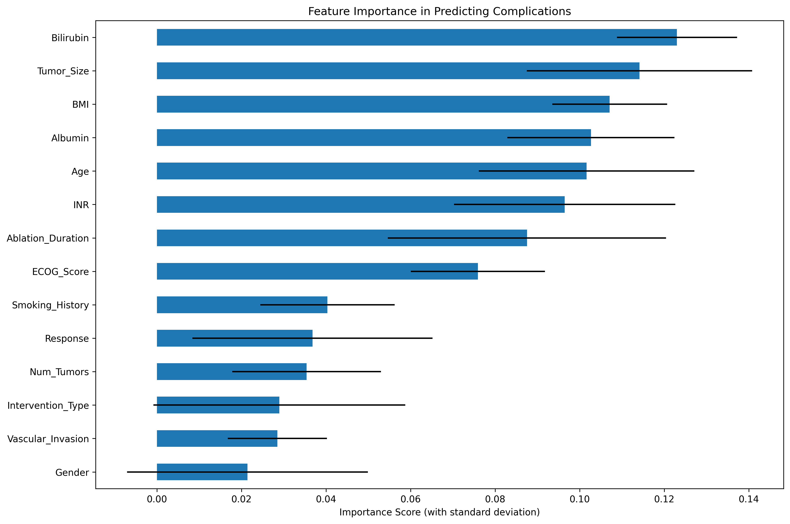
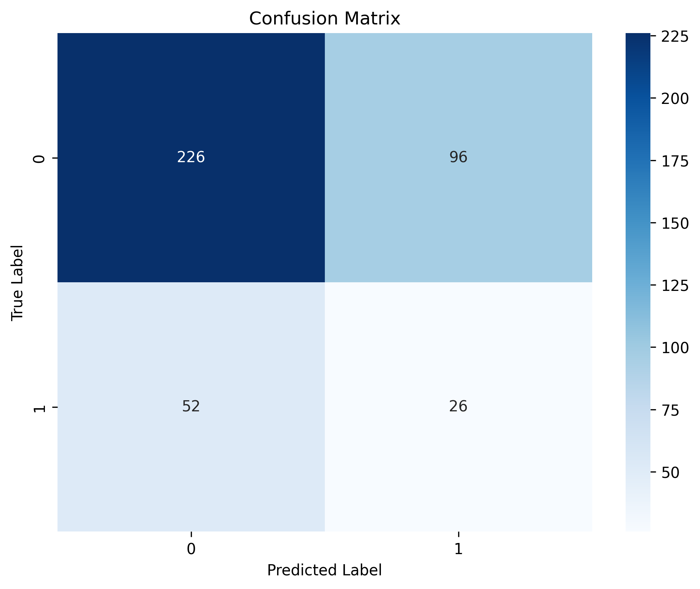
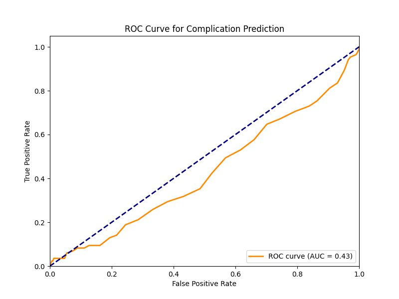

## Model Performance

### Data Distribution

- **No Complications (0):** 80.6%
- **Complications (1):** 19.4%

### Performance Metrics

- **Accuracy:** 63%
- **Sensitivity (True Positive Rate):** 33%
- **Specificity (True Negative Rate):** 70%

### Classification Report

```
              precision    recall  f1-score   support
           0       0.81      0.70      0.75       322
           1       0.21      0.33      0.26        78
    accuracy                           0.63       400
   macro avg       0.51      0.52      0.51       400
weighted avg       0.70      0.63      0.66       400
```

### Feature Importance

**Top 5 Most Important Features:**

1. **Bilirubin:** 0.123022
2. **Tumor Size:** 0.114170
3. **BMI:** 0.107111
4. **Albumin:** 0.102666
5. **Age:** 0.101632

### Generated Visualizations

**Feature Importance**



**Confusion Matrix**



**ROC Curve**



### Model Notes

- **Class imbalance** present in dataset
- **Moderate specificity** but lower sensitivity
- **Strong predictive value** of laboratory parameters
